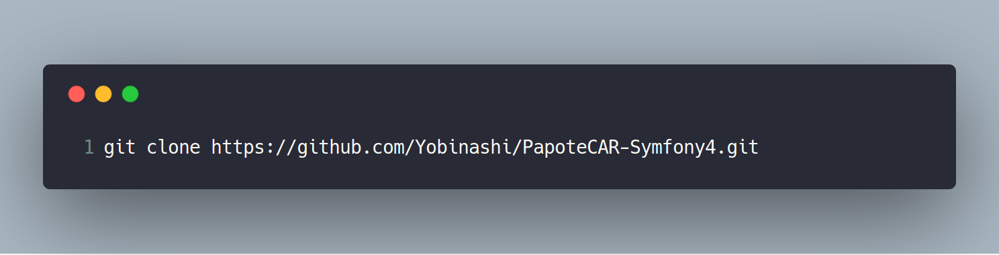

# PapoteCAR-Symfony4

    Projet fil rouge de la POEC Web &amp; Mobile, au sein de l'IMIE | https://numerique.imie.fr/
    Appli web de type BlaBlaCar en Symfony 4 | Projet du groupe **SwatAlpha**.

### Consignes préalables à l'élaboration de l'application web
   
    - **Application de co-voiturage** de type BlaBLaCar avec les principales fonctionalités. 
    - Durée du projet: 4 jours, présentation incluse.

### Langages utilisés:
    
    - PHP / **Symfony 4**
    - HTML 5 / **Twig**
    - CSS / **SCSS**
    - Javascript
    
### Installation

    * Installer composer https://getcomposer.org/download/
    
    * Installer un serveur local du genre Wamp (comme moi) https://sourceforge.net/projects/wampserver/files/
    
    * Configurer PH à une version suppérieur ou égal à la 7.2
        - exemple sous windows: 
             - lancer wamp 
            - en bas à droite (flêche vers le haut), clic gauche sur le W > clic PHP > Version > 7.2
    
    * Cloner le fichier dans un dossier dans C:\wamp\www: (")
    

    * Rendez-vous dans le dossier, toujours avec le terminal. Puis:
    

    * Enfin, afin d'installer les différents composants nécessaire au fonctionnement du projet, faire un:
    

    * Vous pouvez désormais vous rendre dans le champ url du navigateur de votre choix et taper http://localhost/papoteCAR-swatalpha/public, afin d'accéder à l'aplication web.

    ## Bonne navigation !

### Les participants

    - 

### 

